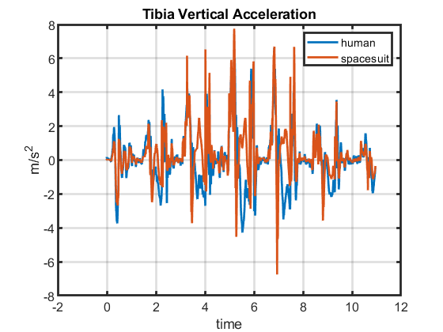
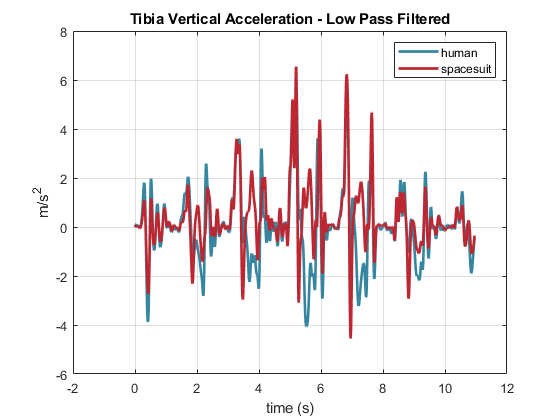
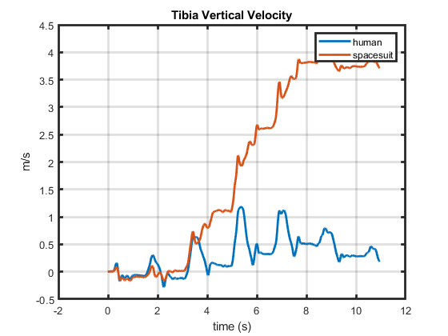
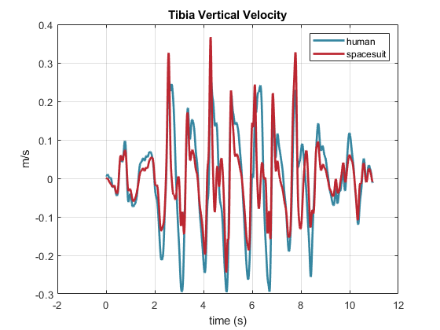
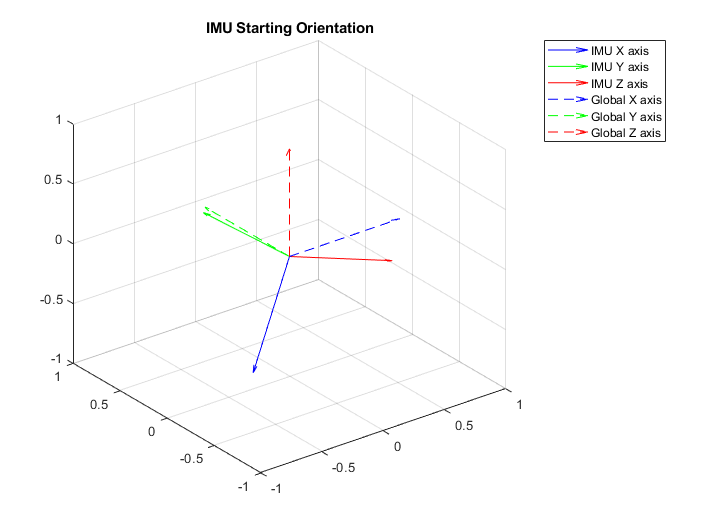
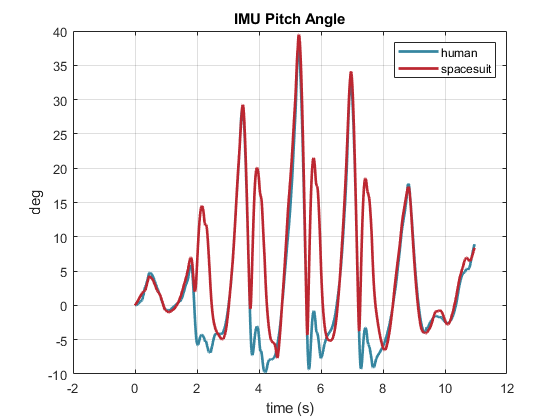
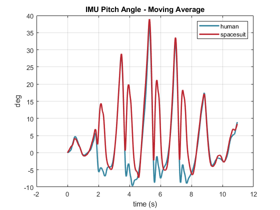

# IMU Data Filtering
The data from the tibia and SLL IMUs is filtered before being analyzed. This includes the acceleration data, the velocity data, and the Euler angles. 

## Acceleration Data
The IMU acceleration data is saved in an nx3 vector, corresponding to the xyz axes.
The axes correlate to: aligned with gravity (x), forward (y), and to the left/right (unsure) (z).

We are most interested in the vertical acceleration data. 
For all our analyses, the x-axis is flipped in order to have positive x represent up. 

*Raw Vertical Acceleration of Tibia and SLL IMU*

### Low Pass Filtering

Downsampling is followed by low-pass filtering to reduce high-frequency noise in the signal.
Anderson and 
A custom script was written (``lowPassButter.m``) to implement a digital low-pass Butterworth filter using MATLAB's  ``filtfilt.m``. 
Antonsson and Mann (1985)[^1] found that 98% of the signal power in gait's vertical amplitude was contained below 10 Hz.
Therefore, the data was filtered with a 5th-order low-pass Butterworth filter with a cutoff frequency of 10 Hz. 

[^1]: Antonsson, E. K., & Mann, R. W. (1985). The frequency content of gait. Journal of Biomechanics, 18(1), 39–47. https://doi.org/10.1016/0021-9290(85)90043-0

*Downsampled and Low-Pass Filtered Vertical Acceleration of Tibia and SLL IMU*

## Velocity Data
The vertical velocity of the tibia and SLL is derived by integrating the downsampled and low-pass filtered vertical acceleration IMU data. 
However, simple integration introduces drift. 

*Raw Vertical Acceleration of Tibia and SLL IMU*

Therefore, a high-pass filter is implemented prior to the integration of the  acceleration data to reduce drift, which occurs at a fairly low frequency (<<1Hz) [^2]. 
A custom script was written (``highPassButter.m``) to implement a digital low-pass Butterworth filter using MATLAB's  ``filtfilt.m``. 

[^2]: Nattamai Sekar, L. P., Santos, A., & Beltramello, O. (2015). Imu drift reduction for augmented reality applications. In L. T. De Paolis & A. Mongelli (Eds.), Augmented and Virtual Reality (pp. 188–196). Springer International Publishing. https://doi.org/10.1007/978-3-319-22888-4_14

The data was filtered with a 5th-order high-order Butterworth filter with a cutoff frequency of 0.7Hz [^3].

[^3]: Ribeiro, J. G. T., & Freire, J. L. F. (1999). Some comments on digital integration to measure displacements using accelerometers, #130. 3727, 554.

*High-pass filtered velocity of Tibia and SLL IMU*

## Angular Data
The APDM provided quaternions represent the IMU's transformation between the global reference frame and the IMU's local coordinate frame. 
The inverse quaternion, representing the transformation between the local coordinate frame to the global reference frame, is preprocessed. 
The IMU's orientation in the global frame can be found by rotating the principal axes by the inverse quaternions (ex:``quatrotate(invquart, X)``). 

*IMU orientation with respect to the global reference frame*

It is noted that the IMU has oriented itself such that the X-axis is aligned with gravity. 
IMU's typically orient the other axes to correspond to the North and East magnetic directions, but the magnetometer was disabled in this dataset, rendering the Y and Z axes to be aligned arbritarily. 

The angular data we are most interested in is the saggital plane motion of the tibia. 
The saggital plane motion can be represented from the deviation of the IMU's local X-axis to the global negative Z-axis. 
This is hereby referred to as the pitch angle. 
The pitch angle is calculated as the angle between the IMU's local x-axis to the global negative Z-axis using the fomula: $atan2(-Z_{global} \times X_{imu}, -Z \cdot X)$

The pitch angle is normalized to it's first value. 

*IMU pitch angle over time*

A moving average filter (``smooth.m``) was used to smooth the pitch angle.. 
The window of the moving average was set to 10 samples. 

*IMU pitch angle with moving average filter*

