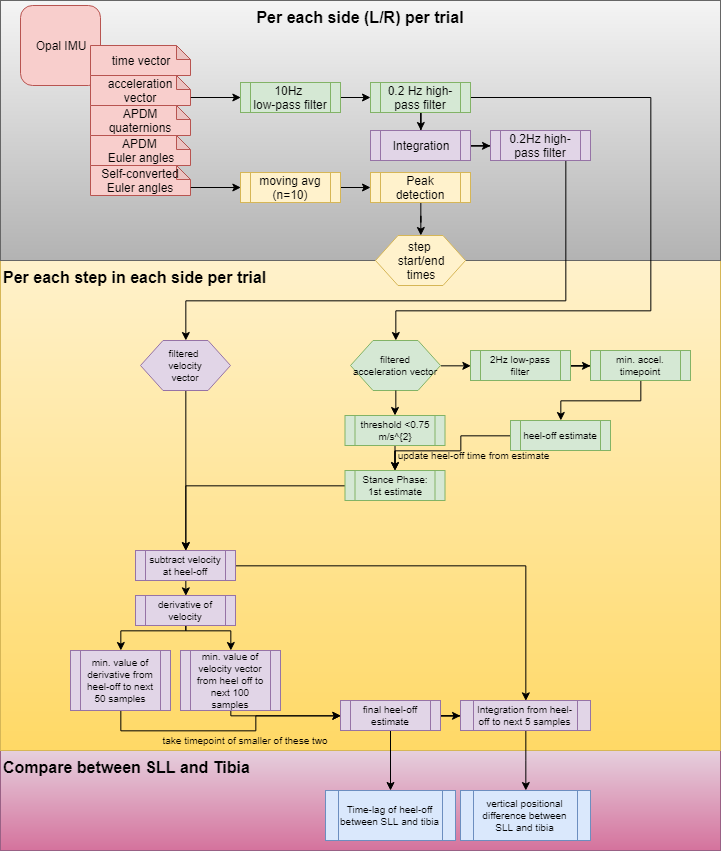

# Quantifying heel slip during gait in the spacesuit

## Terminology
* *SLL*: spacesuit lower leg
* *Tibia*: human tibia

## Introduction

This document presents the methods used to investigate heel slip in the spacesuit boot during gait.

## Methods

The overall flow of data is shown in the following diagram:

The following links provide information the methods used in this study. 

1. [Conversion of .h5 Opal IMU files to .mat files](IMUProcessing.md)
2. [Pre-processing of IMU data](IMUDataFiltering.md)
3. [Step identification and segmentation](segmentSteps.md)
4. [Stance phase detection](zeroAccelThres.md)
5. [Zero Velocity/Zero Position Update](ZVU-ZVP.md)
6. [Heel Slip Calculation](heelslipMeasure.md)

## Results

