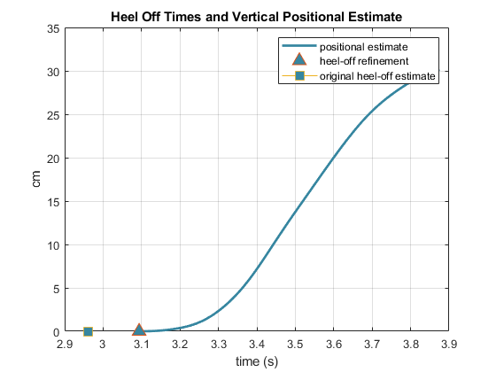

# Zero Velocity / Zero Position Update

Zero-velocity and zero-position updates are used to reduce integration drift and improve the accuracy of the positional estimate of the tibia and SLL.
The high-pass filtered vertical velocity signal is put through a low-pass 6th order Butterworth filter with a cutoff frequency of 6 Hz. 

## Zero-Velocity Update
It is known that the vertical velocity during stance should be zero, but drift from integration will offset this value. 
Therefore, the vertical velocity at heel-off is set to 0, and the vertical velocity after heel-off is subtracted by the velocity reported at heel-off weighted based on the distance from the heel-off timepoint using the following formula [^5]:
$$
v'_{x,i} = v_{x,i} - v_{HO}*\frac{t_{i}-t_{TS}}{t_{HO}-t_{TS}}
$$
[^5]: Feliz Alonso, R., Zalama Casanova, E., & Gómez García-Bermejo, J. (2009). Pedestrian tracking using inertial sensors. *Journal of Physical Agents (JoPha)*, *3*(1), 35–43. https://doi.org/10.14198/JoPha.2009.3.1.05

Where at timestep $i$ after heel-off:
*  $v'_{x,i}$ : corrected velocity
*  $v_{x,i}$ : original velocity
*  $t$ : time
*  $TS$ : at next toe strike
*  $HO$ : at heel-off

## Heel-Off Estimate Refinement
The estimate for heel-off is further refined by looking for the minimum value in the updated velocity vector's derivative at time points from the previous estimate of heel-off to the next 50 samples. 
The minimum value of the velocity vector from the previous estimate of heel-off to the next 100 samples is also calculated.
The time-point of the smallest of these two measurements is estimated to be the true heel-off, and the velocity is set to zero at this point. 

## Zero-Position Update
To calculate the position of the tibia and SLL from heel-off, the integral of the corrected velocity is taken. 
Assuming the interface between the heel and boot is at point 0, taking the integral only from the estimate of heel-off acts as a zero-position update, under the assumption that just before heel-off, the heel and boot are flat on the ground. 

*Zero-Velocity and Zero-position updates used to improve heel-off time estimate and veritical positional estimate for Tibia IMU*

