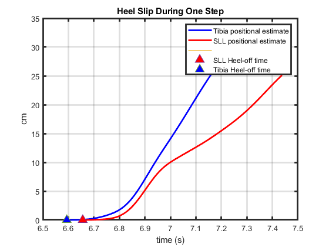

# Measuring Heel Slip

Heel slip can be quantified with two measures: heel-off lag and positional difference. 
Heel-off lag is the difference in heel-off times between the tibia and the SLL. 
Positional difference is the vertical measurement of the tibia over the SLL. 

## Heel-off lag
Heel-off lag is measured by subtracting the heel-off time of the tibia from the heel-off time of the SLL.

*Heel slip measurement quantities between SLL and tibia IMUs*

## Positional Difference
Since drift is not completely eliminated with the methods outlined, bounds need to be established where we can take the positional difference with confidence that the difference is not largely due to the drift. 

Analysis was conducted to determine the rate of drift after the ZVU/ZVP updates were performed.
During stance phase, it's expected that both the SLL and tibia will have the same vertical position at toe-strike and heel-off. 
During swing phase, it is expected that both IMUs will return to the same vertical position after each step. 
Therefore, to calculate drift rate, the position values at the beginning and end of stance phase and swing phase were subtracted from each other, and then divided by the time of each phase, to get a drift rate. 
This rate represents the amount the IMU's positional estimate has drifted over each phase, when it is expected to return to 0. 

| IMU | Stance Phase Median Drift Rate | Swing Phase Median Drift Rate|
|-|-|-|
| Tibia | 9.48 cm/s | 14.15 cm/s|
| SLL | 26.33 cm/s | 27.48 cm/s |

From this analysis, a limit of 0.04 s (1/26.33 cm/s) was used to take the positional difference between the SLL and tibia after heel-off, to measure heel-slip. 
