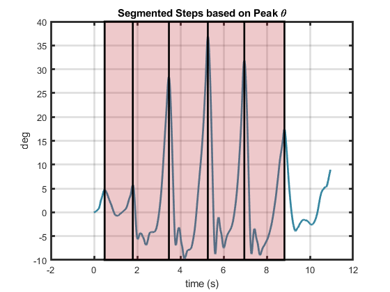

# Step Segmentation
The function ``segmentSteps.m`` is used to detect and segment each step in the IMU data. 

## Peak Detection
The smoothed IMU pitch angle is analyzed with ``findpeaks.m`` to find the peaks in the signal.
These peaks are thought to correspond to the max flexion/extension of the tibia/SLL during the swing phase. 
The parameter *MinPeakDistance* is set to 1.5s to ensure high-frequency peaks are not detected; this parameter was set based on the observed length of each step typically taking longer than 1.5s. 

Each step is defined as the time between each step's max extension to the following step's max extension. 

*Step segmentation through peak angle detection*

## Reshaping
Once the locations of the peaks are detected, they are reshaped into an array which represents the start and end indices of each step. 
Since the peak detection is not a perfect algorithm, the number of steps detected in one trial for the SLL and tibia might not be the same. 
Therefore, whichever IMU had the least amount of steps detected has its step times applied to the other IMU. 

## Step Selection

The first and last steps are discarded, assuming that these steps may have been incomplete due to the subject starting or stopping their trial. 