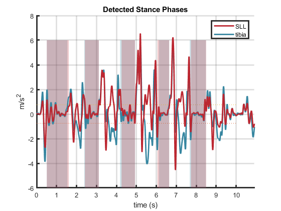

# Stance Phase Detection 

The function ``zeroAccelThres.m`` was written to detect stance phase for each step. 
The downsampled and low-pass filtered acceleration data is used to detect the stance phase. 

## Finding Zero-Acceleration Points
Stance phase is detected by looking for the region of zero vertical acceleration in each step [^4].
First, ``threshold.m`` is used to find values that are between $\pm$ the threshold value in the acceleration vector. 
The threshold value was set to $0.75 m/s^{2}$, which is slighly lower than noted in the literature ($0.8 m/s^{2}$) [^4]. 
The lower value was selected as higher values detect a longer duration of heel-off as stance, which is undesirable for reliably detecting the precise time of heel-off.
This returns a truth array, where 1's represent points in the vector which are between the $\pm$ threshold value (acceptable zero-acceleration points), and 0's represent points which are not. 
The start and stop of the zero-acceleration points is found by taking the difference between each value of the truth array. 
The 1 in the difference array is the start of the zero-acceleration period, and the -1 is the end; the indexes corresponding to these times are found. 
The times of the zero-acceleration points are found by multiplying the truth array by the indexes 
The function returns a nx2 array of stance times, where n is the number of steps, the first column is the start time of the stance phases and the second column is the end time. 

*Stance phase detected by finding zero-acceleration points in each step*

[^4]:Rebula, J. R., Ojeda, L. V., Adamczyk, P. G., & Kuo, A. D. (2013). Measurement of foot placement and its variability with inertial sensors. Gait & Posture, 38(4), 974–980. https://doi.org/10.1016/j.gaitpost.2013.05.012
## Stance Phase Refinement
The stance phases detected with this method are not fully accurate; the start and end times may fall below the threshold and therefore do not represent toe-strike and heel-off (the start and end of stance, respectively). 
The stance phase is further refined by further low-pass filtering the vertical acceleration signal (5th order Butterworth, 2Hz cutoff), and looking for the minimum vertical acceleration value in this signal within a range of -20 to +30 samples from the originally calculated end of stance phase. 
This point more accurately represents heel-off, and the stance vector is modified as such. 

