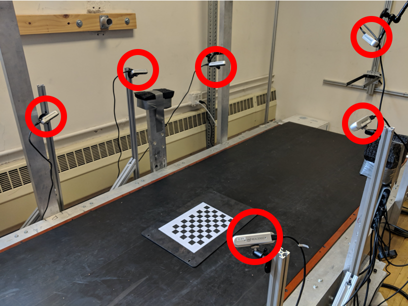
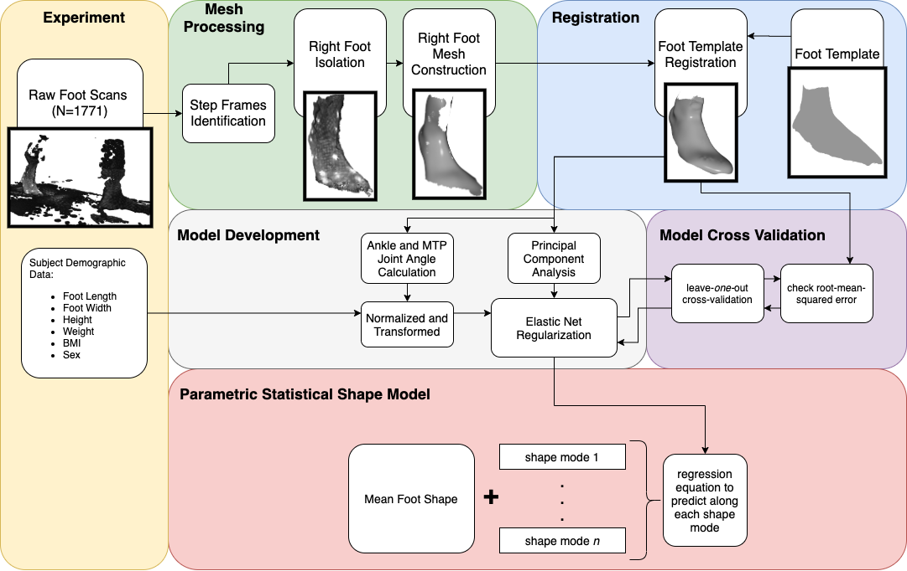
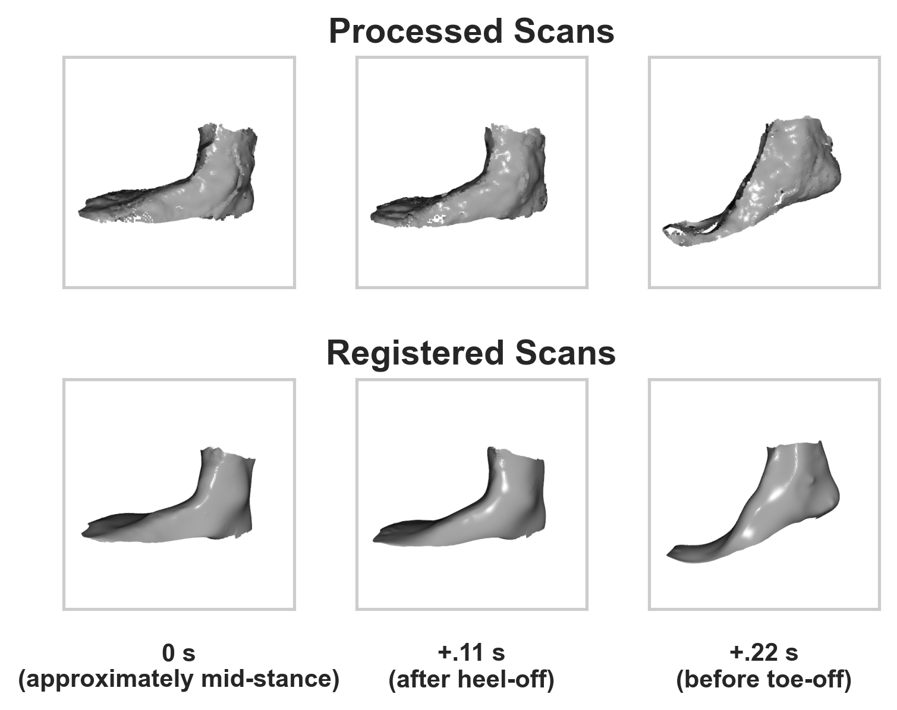
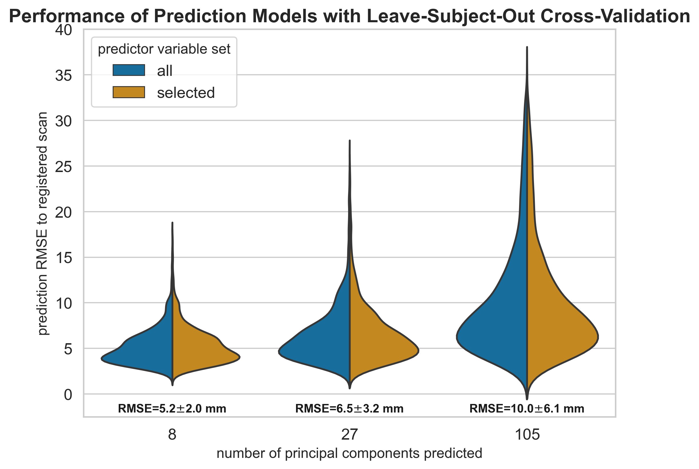
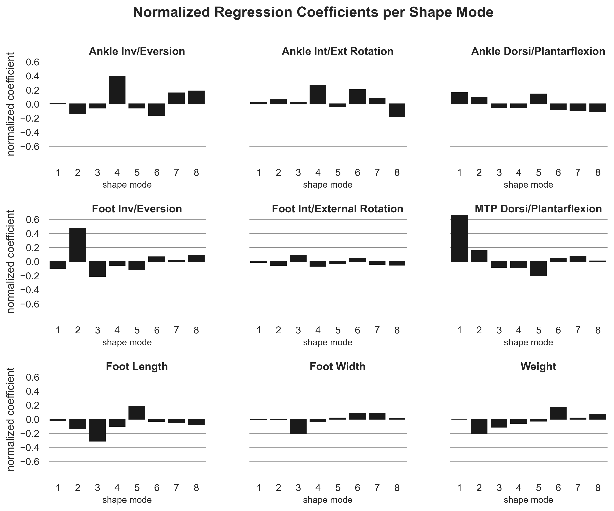

\newpage

# Figures and Tables {-}

All tables, figures, and respective captions are listed below

| Sex    | 5th-35th percentile Height | 35th-65th percentile Height | 65th-95th percentile Height |
| ------ | -------------------------- | --------------------------- | --------------------------- |
| Female | 4'11"-5'3"                 | 5'3"-5'5"                   | 5'5"-5'8"                   |
| Male   | 5'4"-5'8"                  | 5'8"-5'11"                  | 5'11"-6'2"                  |

: Enrollment groups based on reported height. 5 subjects were enrolled in each group {#tbl:groups}

\newpage
{#fig:testSetup width=100%}

\newpage
{#fig:dataflow width=100%}

\newpage
{#fig:scans width=100%}

\newpage
{#fig:modelperf width=100%}

\newpage
{#fig:coefs width=100%}

\newpage
{#fig:pca_quad width=100%}

\newpage
{#fig:pca_overlay width=100%}