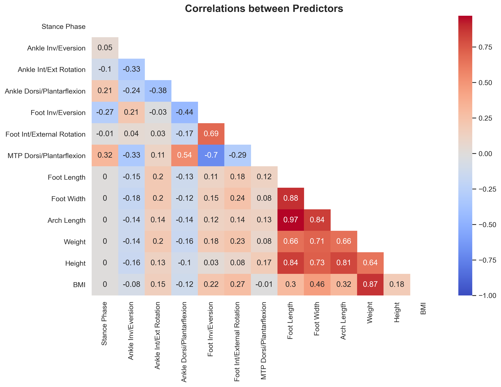
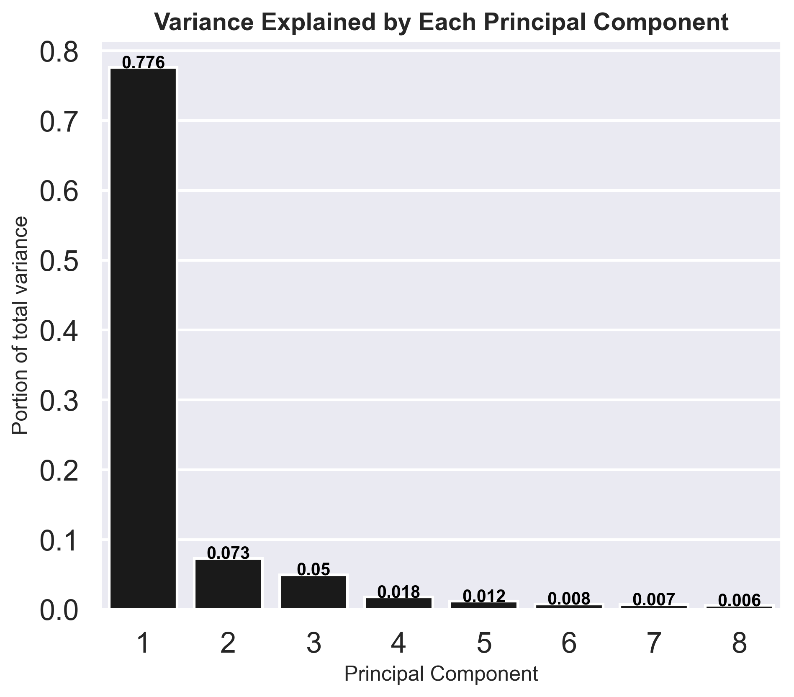

\newpage

# Appendix II : Supplemental Figures {-}

{#fig:supp:corr width=90%}

{#fig:pcav width=30%}

# Appendix III : Supplemental Video {-}

The attached video shows the predictive capability of the developed parametric statistical shape model. 
The sliders predicts principal component scores, which are then inverse-transformed into a foot shape. 
The stance phase slider predicts joint angles during the stance phase to visualize foot morphology changes during stance phase. 